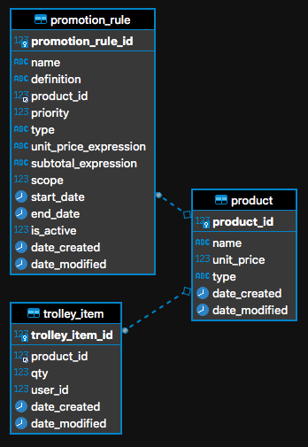

# Endeavour Demo

An API project for the endeavour code challenge.

## Technical Specification

- Backend: .Net 5
- Database: AWS Aurora (MySQL 5.7)

## How to use

- Run `EndeavourDemo` project under the dev mode.
- Visit `http://localhost:5000/swagger/index.html`.
- With the help of `​/product​/list`, try CRUD the trolley.
- API Tests are placed in `EndeavourDemoTest` project.

## Database ER Diagram

## Implementation of the promotion rule

To make various promotion rules store in the database, the actual expression/formula of the promotion rule are written in [Expression Syntax](https://docs.microsoft.com/en-us/dotnet/api/system.data.datacolumn.expression?view=net-5.0#expression-syntax), which would be interpreted by the `compute()` function of `Data Table` in .Net.
